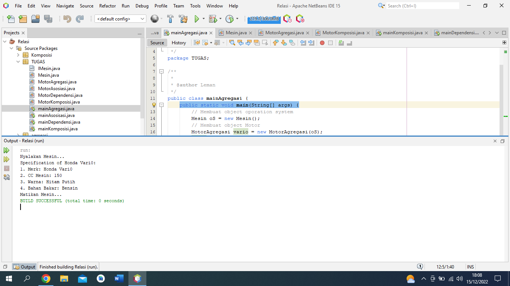
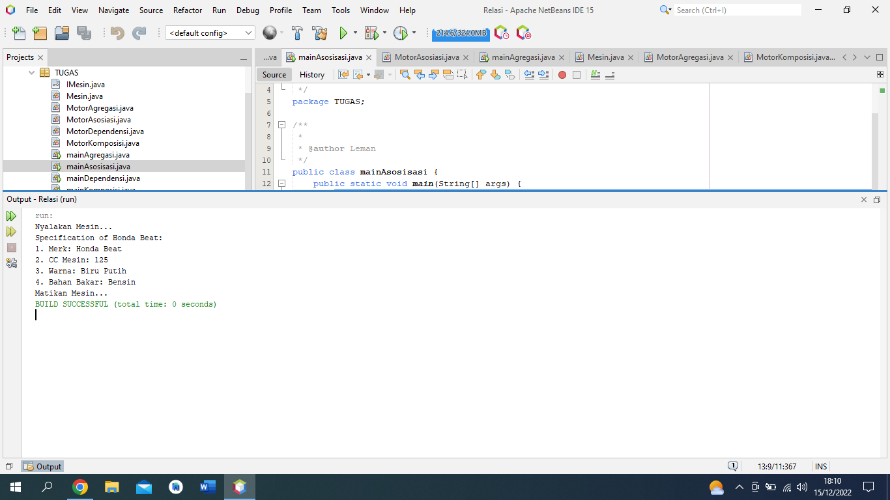
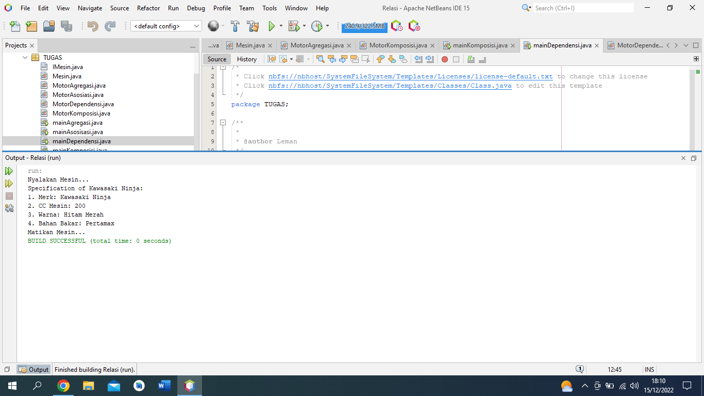
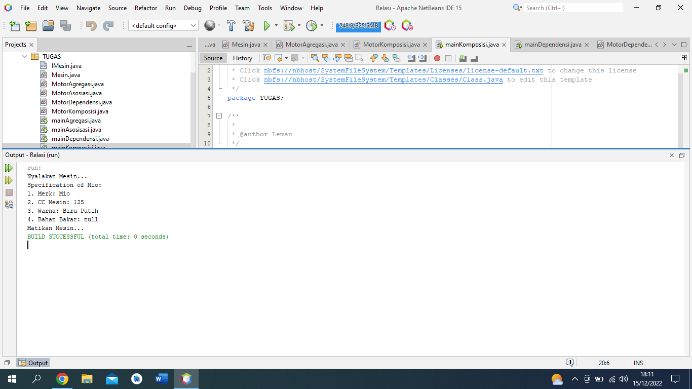

# latihanjava7
___
## Program Relasi

• Mendeklarasikan <i>class IMesin</i> yang merupakan java Interface
```java 
    public interface IMesin {
    void nyala();
    void mati();
    }

```
• Mendeklarasikan <i>class Mesin</i> yang merupakan class implements dari Interface <i>IMesin</i>
```java 
    public class Mesin implements IMesin {
        public String Mesin;
        public String OSVersion;

        @Override
        public void nyala() {
            System.out.println("Nyalakan Mesin...");
        }

        @Override
        public void mati() {
            System.out.println("Matikan Mesin...");
        }
    }
```
___
• Mendeklarasikan <i>class MotorAgregasi</i> 
```java 
    public class MotorAgregasi {
        private String merk;
        private int cc;
        private String warna;
        private String bahanbakar;
        private final Mesin operationSystem;

        public MotorAgregasi(Mesin oS) {
            operationSystem = oS;
        }

        public void setMerk(String merk) {
            this.merk = merk;
        }

        public void setCC(int cc) {
            this.cc = cc;
        }

        public void setWarna(String warna) {
            this.warna = warna;
        }

        public void setBahanbakar(String bahanbakar) {
            this.bahanbakar = bahanbakar;
        }


        public void turnOnDevice() {
            operationSystem.nyala();
        }

        public void turnOffDevice() {
            operationSystem.mati();
        }


        public void cetak() {
            System.out.println("Specification of " + this.merk + ":");
            System.out.println("1. Merk: " + this.merk);
            System.out.println("2. CC Mesin: " + this.cc);
            System.out.println("3. Warna: " + this.warna);
            System.out.println("4. Bahan Bakar: " + this.bahanbakar);
        }
    }
```
• Mendeklarasikan <i>class mainAgregasi</i> class main dari program Agregasi
```java 
    public class mainAgregasi {
        public static void main(String[] args) {
            // Membuat object oporation system
            Mesin oS = new Mesin();
            // Membuat object Motor
            MotorAgregasi vario = new MotorAgregasi(oS);
            vario.setMerk("Honda Vari0");
            vario.setCC(150);
            vario.setWarna("Hitam Putih");
            vario.setBahanbakar("Bensin");
            vario.turnOnDevice();
            vario.cetak();
            vario.turnOffDevice();
        }
    }
```
• Hasil Run

___
• Mendeklarasikan <i>class MotorAsosiasi</i> 
```java 
        public class MotorAsosiasi {
            private String merk;
            private int cc;
            private String warna;
            private String bahanbakar;
            private final Mesin operationSystem;

            public MotorAsosiasi(Mesin oS) {
                operationSystem = oS;
            }

            public void setMerk(String merk) {
                this.merk = merk;
            }

            public void setCC(int cc) {
                this.cc = cc;
            }

            public void setWarna(String warna) {
                this.warna = warna;
            }

            public void setBahanbakar(String bahanbakar) {
                this.bahanbakar = bahanbakar;
            }


            public void turnOnDevice() {
                operationSystem.nyala();
            }

            public void turnOffDevice() {
                operationSystem.mati();
            }


            public void cetak() {
                System.out.println("Specification of " + this.merk + ":");
                System.out.println("1. Merk: " + this.merk);
                System.out.println("2. CC Mesin: " + this.cc);
                System.out.println("3. Warna: " + this.warna);
                System.out.println("4. Bahan Bakar: " + this.bahanbakar);
            }
        }
```
• Mendeklarasikan <i>class mainAsoiasi</i> class main dari program Asoiasi
```java 
    public class mainAsosisasi {
        public static void main(String[] args) {
            // Membuat object oporation system
            Mesin oS = new Mesin();
            // Membuat object Motor
            MotorAsosiasi beat = new MotorAsosiasi(oS);
            beat.setMerk("Honda Beat");
            beat.setCC(125);
            beat.setWarna("Biru Putih");
            beat.setBahanbakar("Bensin");
            beat.turnOnDevice();
            beat.cetak();
            beat.turnOffDevice();
        }
    }
```
• Hasil Run

___
• Mendeklarasikan <i>class MotorDependensi</i> 
```java 
public class MotorDependensi {
    private String merk;
    private int cc;
    private String warna;
    private String bahanbakar;
    private final Mesin operationSystem;

    public MotorDependensi(Mesin oS) {
        operationSystem = oS;
    }

    public void setMerk(String merk) {
        this.merk = merk;
    }

    public void setCC(int cc) {
        this.cc = cc;
    }

    public void setWarna(String warna) {
        this.warna = warna;
    }

    public void setBahanbakar(String bahanbakar) {
        this.bahanbakar = bahanbakar;
    }


    public void turnOnDevice() {
        operationSystem.nyala();
    }

    public void turnOffDevice() {
        operationSystem.mati();
    }


    public void cetak() {
        System.out.println("Specification of " + this.merk + ":");
        System.out.println("1. Merk: " + this.merk);
        System.out.println("2. CC Mesin: " + this.cc);
        System.out.println("3. Warna: " + this.warna);
        System.out.println("4. Bahan Bakar: " + this.bahanbakar);
    }
}
```
• Mendeklarasikan <i>class mainDependensi</i> class main dari program Dependensi
```java 
    public class mainDependensi {
        public static void main(String[] args) {
        // Membuat object oporation system
            Mesin oS = new Mesin();
            // Membuat object Motor
            MotorAgregasi Ninja = new MotorAgregasi(oS);
            Ninja.setMerk("Kawasaki Ninja");
            Ninja.setCC(200);
            Ninja.setWarna("Hitam Merah");
            Ninja.setBahanbakar("Pertamax");
            Ninja.turnOnDevice();
            Ninja.cetak();
            Ninja.turnOffDevice();
        }
    }
```
• Hasil Run

___
• Mendeklarasikan <i>class MotorKomposisi</i> 
```java 
public class MotorKomposisi {

    private String merk;
    private int cc;
    private String warna;
    private String bahanbakar;
    private final Mesin operationSystem;

    public MotorKomposisi(String oS, String merk, int cc, String warna, String bensin) {
        operationSystem = new Mesin();
        operationSystem.Mesin = oS;
        this.merk = merk;
        this.cc = cc;
        this.warna = warna;
        this.bahanbakar = bahanbakar;
    }
     public void turnOnDevice() {
        operationSystem.nyala();
    }

    public void turnOffDevice() {
        operationSystem.mati();
    }
    public void cetak() {
        System.out.println("Specification of " + this.merk + ":");
        System.out.println("1. Merk: " + this.merk);
        System.out.println("2. CC Mesin: " + this.cc);
        System.out.println("3. Warna: " + this.warna);
        System.out.println("4. Bahan Bakar: " + this.bahanbakar);
    }
}
```
• Mendeklarasikan <i>class mainKomposisi</i> class main dari program Komposisi
```java 
    public class mainKomposisi {

        public static void main(String[] args) {
            MotorKomposisi Mio = new MotorKomposisi("Yamaha", "Mio", 125, "Biru Putih", "Bensin");
            Mio.turnOnDevice();
            Mio.cetak();
            Mio.turnOffDevice();
        }
    }  
```
• Hasil Run
